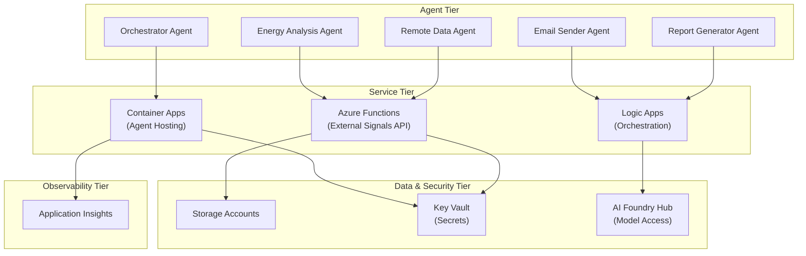
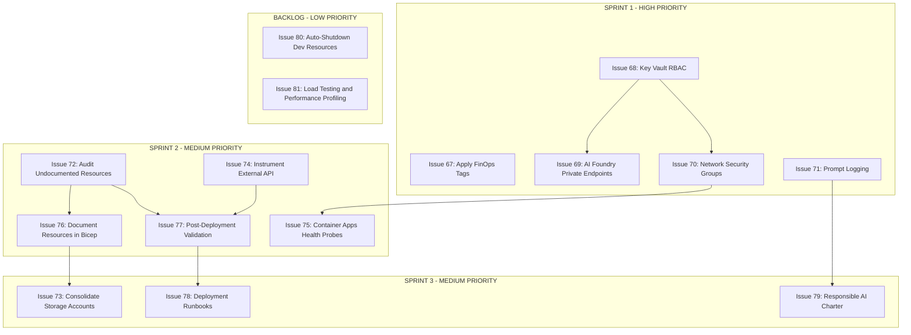

# Architecture Review Chat Mode Instructions

**This is the definitive reference document for the architectural review process.**

**Related files:**

- **Chatmode Definition:** `.github/chatmodes/enterprise-cloud-ai-architect.chatmode.md`
- **Tactical Execution Guide:** `.github/prompts/architectual-review.prompt.md` (drift comparison, ARG queries)
- **Report Template:** `architecture/ARCHITECT_REPORT_TEMPLATE.md`

---

## Overview

The architectural review process follows a **structured, 4-phase approach**:

1. **Inventory & Collection** – Gather resource data and IaC definitions
2. **Analysis** – Assess against Azure Well-Architected Framework + AI Governance pillars
3. **Recommendations** – Generate actionable improvements with effort/severity estimates
4. **Deliverables** – Produce Final Report and Epic with Mermaid diagrams and issue templates

---

## Critical Requirements

### 1. Azure Resource Queries

- **ALWAYS use Azure MCP tools** (`activate_azure_*`, `mcp_azure_mcp_*`) for querying Azure resources
- **NEVER use terminal commands** (e.g., `az` CLI commands)
- **Rationale:** Ensures secure, authenticated, and auditable resource queries
- **ARG Queries:** See `.github/prompts/architectual-review.prompt.md` for query templates

### 2. Documentation Formatting & Diagrams

- **Issue formatting:** Use clear markdown with proper spacing between sections
- **Final Report:** Include **Mermaid diagram** of the application architecture being reviewed
- **Epic (Issue):** Include **Mermaid diagram** showing issue dependencies and relationships
- All diagrams must use proper Mermaid syntax (graph TB, flowchart, etc.)

### 3. Issue Quality Standards

- Ensure consistent formatting across all GitHub issues
- Include code blocks with proper syntax highlighting where relevant
- Separate sections with markdown headers (level 2 and 3)
- Use tables for structured data (resources, metrics, effort estimates)
- Include proper spacing (blank lines between sections)

---

## Architectural Review Process

### Phase 1: Inventory & Collection

- Use Azure Resource Graph (ARG) queries via Azure MCP tools
- Collect Bicep infrastructure modules from `infra/` directory
- Map deployed resources to IaC definitions
- Identify drift and undocumented resources

### Phase 2: Analysis (Well-Architected Framework + AI Governance)

**Pillars:**

1. Security & Identity
2. Reliability & Resilience
3. Performance Efficiency
4. Cost Optimization
5. Operational Excellence
6. Sustainability
7. AI Governance & Data Ethics (Responsible AI)

**Process:**

- Review each pillar for strengths, gaps, and risks
- Assess severity (High/Medium/Low)
- Document evidence-based findings
- Cross-reference infrastructure modules and Azure resources

### Phase 3: Recommendations

- Document all recommendations with: **Pillar, Action, Rationale, Effort (S/M/L), Severity (High/Medium/Low)**
- Reference specific file paths and resource IDs
- Use action verbs: Implement, Establish, Adopt, Centralize, Instrument, Validate

### Phase 4: Deliverables

#### Final Report (Issue #82 Format)

- Comprehensive findings document (~1,200-1,500 words)
- Include **Mermaid architecture diagram** showing:
  - Application components (agents, services, infrastructure)
  - Data flows and dependencies
  - Azure resource topology
- Use template: `architecture/ARCHITECT_REPORT_TEMPLATE.md`

#### Master Epic (Issue #83)

- Link all recommendation issues as sub-issues
- Include **Mermaid dependency diagram** showing:
  - Issue relationships (parent-child)
  - Sprint grouping (Sprint 1 HIGH, Sprint 2-3 MEDIUM, Backlog LOW)
  - Dependency chains and blocking relationships
- Provide sprint breakdown, resource allocation, success criteria
- Include Slack notification template

#### Individual Recommendation Issues (15 issues)

- Properly formatted with clear sections
- Acceptance criteria with bullet points
- Implementation plan (step-by-step)
- Testing strategy
- Reference paths to code/infrastructure

---

## Mermaid Diagram Templates

### Application Architecture Diagram (Final Report)

Use this template to show system topology:

### Issue Dependency Diagram (Epic)

Use this template to show sprint grouping and dependencies:

---

## Quality Checklist (Pre-Release)

- [ ] All Azure queries executed via Azure MCP (NOT terminal)
- [ ] Final Report includes Mermaid architecture diagram
- [ ] Epic includes Mermaid dependency diagram
- [ ] All issues formatted consistently with proper markdown
- [ ] All recommendations reference specific file paths
- [ ] Word counts within limits (snapshot ≤600, final ≤1500)
- [ ] No secrets or credentials exposed
- [ ] Success metrics include current/target states
- [ ] Sprint dependencies clearly documented
- [ ] Resource allocation provided for all roles

---

## How to Use This Document

### For Future Architecture Reviews

1. **Load this file as a chat mode prompt** in Copilot
2. **Follow Phase 1-4 sequentially**
3. **Reference the Mermaid templates** for Final Report and Epic
4. **Use Azure MCP tools** exclusively for resource queries
5. **Run the Quality Checklist** before publishing any issues

### Sample prompt

I need to conduct an architectural review of the [Project Name] solution.

Please:

1. Use the instructions in architecture/ARCHITECT_CHAT_MODE_INSTRUCTIONS.md
2. Query Azure resources via Azure MCP (NOT terminal)
3. Include Mermaid diagrams in Final Report and Epic
4. Create 15 recommendation issues with proper formatting
5. Run the quality checklist before completion

---

## Related Documents

- **Architect Persona:** `architecture/ARCHITECT_PERSONA.md`
- **Report Template:** `architecture/ARCHITECT_REPORT_TEMPLATE.md`
- **Issue Conversion Guide:** `architecture/ISSUE_CONVERSION_GUIDE.md`
- **Data Collection Queries:** `architecture/DATA_COLLECTION_QUERIES.md`
- **Extended Practices:** `architecture/EXTENDED_PRACTICES.md`